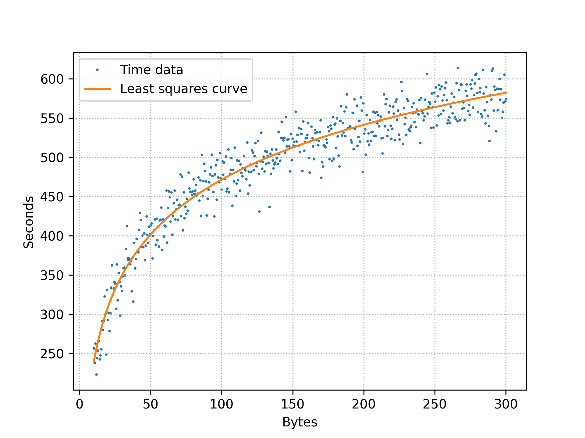

# lsq-fit-demo

Demonstrates [scipy.optimize.least_squares](https://docs.scipy.org/doc/scipy/reference/generated/scipy.optimize.least_squares.html) method to fit a user-defined function to a set of data points (x,y) using numerical nonlinear least-squares Marquardt-Levenberg algorithm (same as gnuplot's [fit](http://gnuplot.sourceforge.net/docs_4.2/node82.html) command).

## Build

```bash
$ pip install -r requirements.txt
$ python generate_input.py
mat.shape=(501, 2)
$ python fit.py
`ftol` termination condition is satisfied.
Function evaluations 10, initial cost 6.2682e+07, final cost 1.0393e+05, first-order optimality 5.62e-04.
Found params: [100.73464044   7.54338673]
```

## Examples


